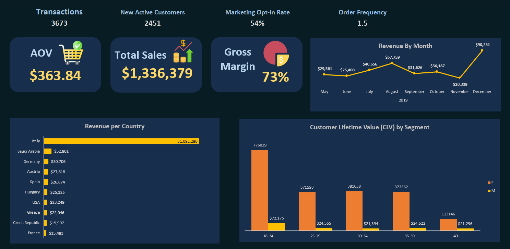
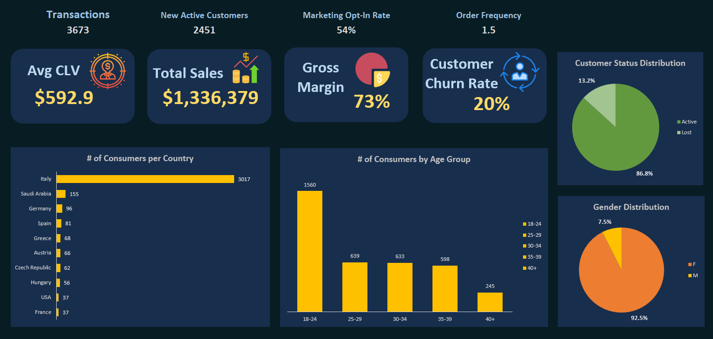
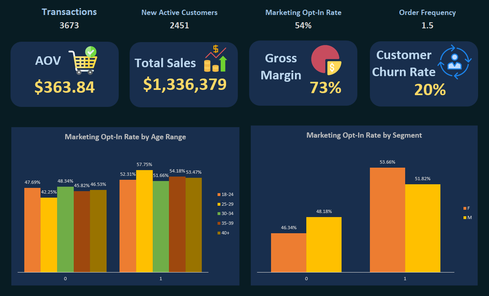
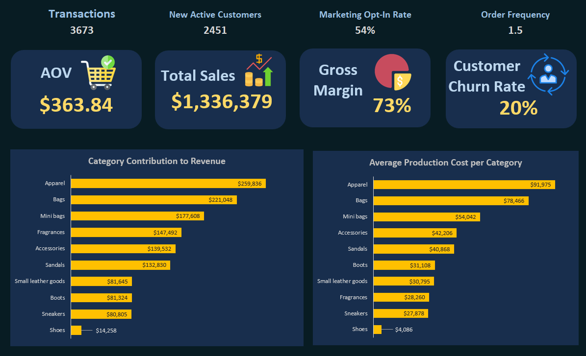

# Sales, Marketing, Product, and Customer KPIs Analysis

This project analyzes key performance indicators (KPIs) across sales, marketing, product, and customer segments. The data provides insights into transactions, customer behavior, revenue, and product performance. Additionally, Python was used in a Jupyter Notebook to perform exploratory data analysis (EDA), preprocess the data, and predict Customer Lifetime Value (CLV) using RandomForest and XGBoost models.

## Visualizations and Notebook

### Screenshots of Excel Analysis
Below are the screenshots of the Excel analysis performed on the dataset:

*Figure 1: Sales KPIs*

*Figure 2: Customer KPIs*

*Figure 3: Marketing KPIs*

*Figure 4: Product KPIs*

### Kaggle Notebook
The detailed analysis and modeling process can be found in the Kaggle notebook:

*Click the badge above to view the Kaggle notebook.*

## Overview

- **Transactions**: 3,673
- **New Active Customers**: 2,451
- **Marketing Opt-In Rate**: 54%
- **Order Frequency**: 1.5
- **Average Order Value (AOV)**: $363.84
- **Total Sales**: $1,336,379
- **Gross Margin**: 73%
- **Customer Churn Rate**: 20%

## Sales KPIs

### Revenue by Month
- November 2019: $97,799
- December 2019: $93,451
- Other months: $92,408, $40,655, $11,656, $64,187, $30,319

### Revenue by Country
- Italy: $109,280
- Germany: $89,706
- Austria: $27,818
- Spain: $26,674
- Hungary: $25,325
- USA: $23,249
- Greece: $22,048
- Czech Republic: $19,997
- France: $13,488

### Customer Lifetime Value (CLV) by Segment
- F, 18-24: 770,029
- F, 28-29: 371,039
- F, 30-34: 381,658
- F, 35-39: 377,282
- F, 40+: 113,146

## Marketing KPIs

### Marketing Opt-In Rate by Age Range
- 18-24: 57.75%
- 25-29: 53.66%
- 30-34: 47.69%
- 35-39: 48.34%
- 40+: 52.31%

### Marketing Opt-In Rate by Segment
- E: 51.68%
- M: 54.18%

## Product KPIs

### Category Contribution to Revenue
- Apparel: $259,838
- Bags: $221,048
- Mini bags: $177,658
- Fragrances: $147,492
- Accessories: $159,552
- Sandals: $182,830
- Boots: $31,924
- Small leather goods: $30,795
- Sneakers: $80,808
- Shoes: $14,258

### Average Production Cost per Category
- Apparel: $91,975
- Bags: $78,466
- Mini bags: $83,032
- Accessories: $42,205
- Sandals: $40,868
- Boots: $31,108
- Small leather goods: $31,645
- Fragrances: $38,260
- Sneakers: $27,876
- Shoes: $4,086

## Customer KPIs

### Customer Status Distribution
- Active: 13.2%

### Number of Consumers per Country
- Italy: 195
- Saudi Arabia: 96
- Germany: 81
- Spain: 68
- Greece: 60
- Austria: 56
- Czech Republic: 57
- Hungary: 2017
- USA: 1960
- France: 699

### Number of Consumers by Age Group
- 18-24: 693
- 25-29: 599
- 30-34: 595
- 35-39: 57.75%
- 40+: 53.66%

### Gender Distribution
- Female: 7.5%

## Data Analysis and Modeling

### Exploratory Data Analysis (EDA)
- Performed EDA to understand the distribution of data, identify missing values, and detect outliers.
- Visualized key metrics such as revenue distribution, customer demographics, and product performance.

### Data Preprocessing
- Handled missing values and encoded categorical variables.
- Normalized and scaled numerical features to prepare the data for modeling.

### Predictive Modeling
- **RandomForest**: Used to predict Customer Lifetime Value (CLV) based on customer demographics and purchase behavior.
- **XGBoost**: Applied to enhance the prediction accuracy of CLV by leveraging gradient boosting techniques.

### Model Evaluation
- Evaluated model performance using metrics such as Mean Absolute Error (MAE) and Root Mean Squared Error (RMSE).
- Compared the performance of RandomForest and XGBoost to select the best model for CLV prediction.

## Conclusion
This analysis provides a comprehensive view of the company's performance across various dimensions. The insights can be used to make data-driven decisions to improve sales, marketing strategies, product offerings, and customer satisfaction. The predictive models offer valuable tools for estimating future customer value, aiding in targeted marketing and customer retention strategies.
